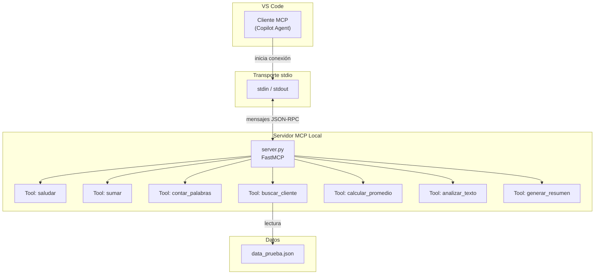
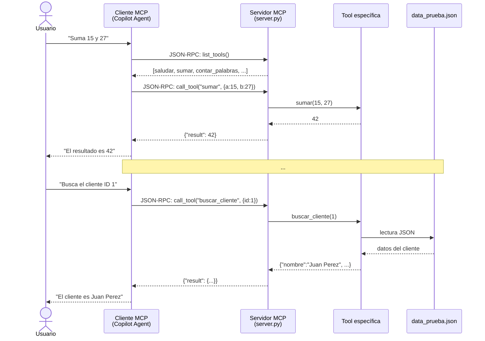
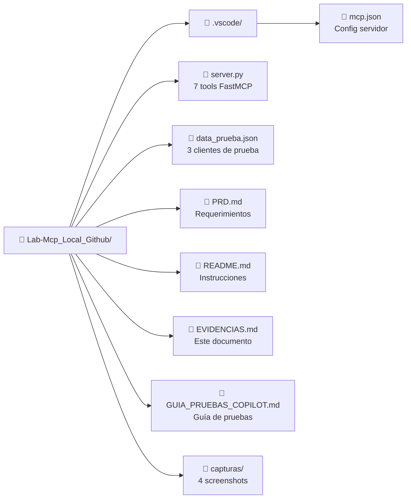
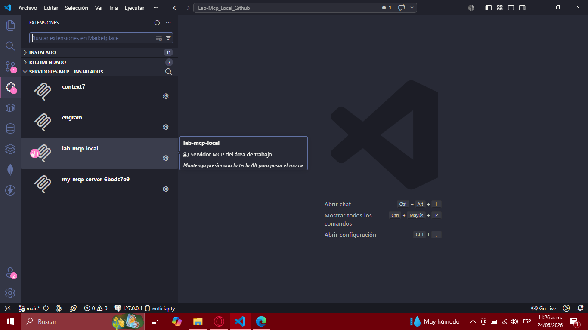
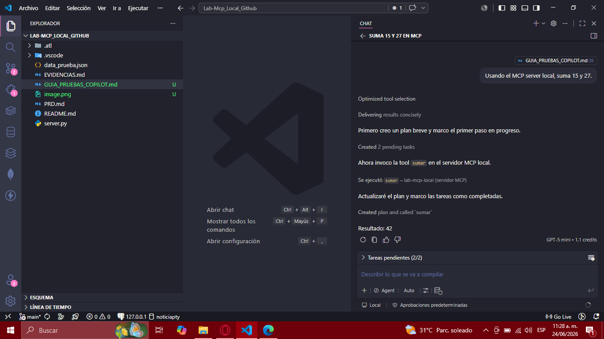
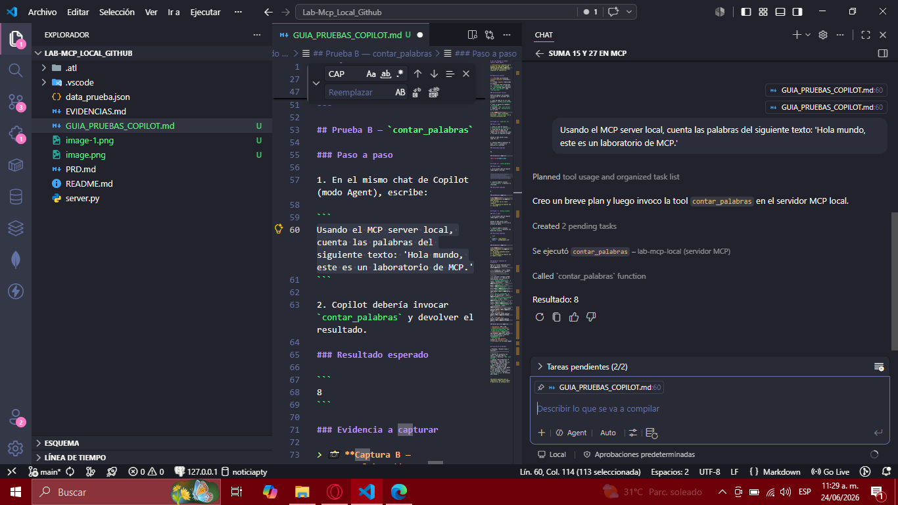
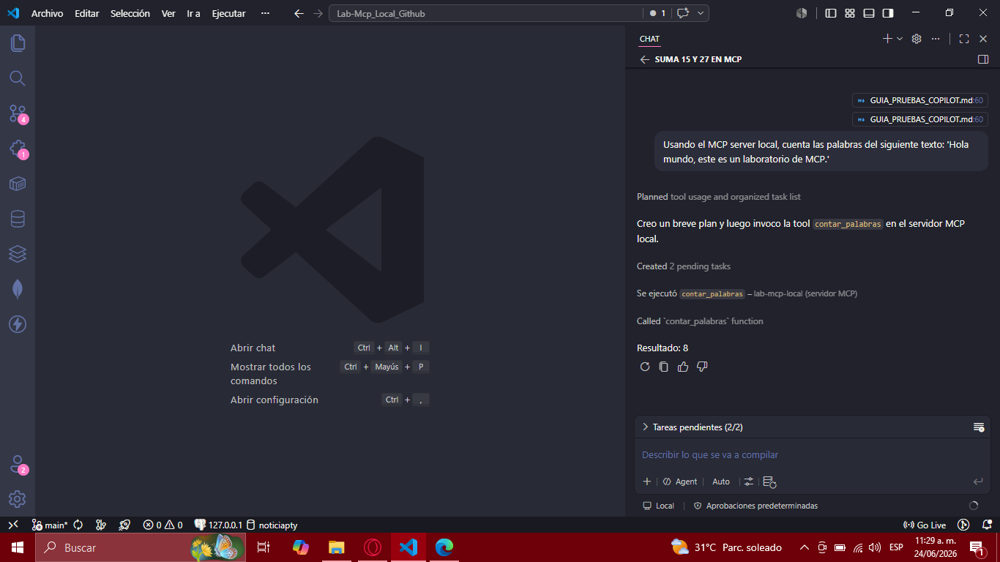

# Evidencias — Laboratorio MCP Local

> **Proyecto**: Lab-Mcp_Local_Github
> **Fecha de pruebas**: 24 de junio de 2026
> **Cliente MCP**: GitHub Copilot (modo Agent) en VS Code
> **Servidor**: `server.py` — FastMCP sobre stdio

---

## Índice

1. [Diagramas de arquitectura](#1-diagramas-de-arquitectura)
2. [Capturas de verificación y pruebas](#2-capturas-de-verificación-y-pruebas)
3. [Tools Base (3 tools)](#3-tools-base-3-tools)
4. [Tools de Reto (4 tools)](#4-tools-de-reto-4-tools)
5. [Resumen de resultados](#5-resumen-de-resultados)
6. [Plan de Pruebas del PRD](#6-plan-de-pruebas-del-prd-sección-7)
7. [Checklist de finalización](#7-checklist-de-finalización)

---

## 1. Diagramas de arquitectura

### 1.1 Arquitectura general del sistema



**Descripción**: VS Code inicia el servidor `server.py` a través del transporte stdio. FastMCP registra 7 tools. El cliente invoca las tools y el servidor devuelve resultados. Las tools que requieren datos (`buscar_cliente`) leen de `data_prueba.json`.

---

### 1.2 Flujo de invocación de una tool



---

### 1.3 Estructura del proyecto



---

## 2. Capturas de verificación y pruebas

> Todas las capturas fueron tomadas desde GitHub Copilot en modo Agent dentro de VS Code.
> Las imágenes se encuentran en la carpeta [`capturas/`](./capturas).

### 2.1 Verificación: Servidor MCP listado en VS Code



El servidor `lab-mcp-local` aparece correctamente en `MCP: List Servers` de VS Code, confirmando que la configuración en `.vscode/mcp.json` es correcta y que el servidor se comunica por stdio sin errores.

---

### 2.2 Prueba A — `sumar(15, 27)` desde Copilot Agent



**Prompt**: "Usando el MCP server local, suma 15 y 27."
**Resultado**: `42` ✅

Copilot descubre la tool `sumar`, la invoca con los parámetros correctos y devuelve el resultado.

---

### 2.3 Prueba B — `contar_palabras` desde Copilot Agent



**Prompt**: "Usando el MCP server local, cuenta las palabras del siguiente texto: 'Hola mundo, este es un laboratorio de MCP.'"
**Resultado**: `8` ✅

---

### 2.4 Prueba C — `buscar_cliente(ID 1)` desde Copilot Agent



**Prompt**: "Usando el MCP server local, busca el cliente con ID 1 en el archivo de datos."
**Resultado**: Nombre: Juan Perez, Email: juan@example.com ✅

---

## 3. Tools Base (3 tools)

### 3.1 `saludar`

**Tool**: `saludar(nombre: str) -> str`

| # | Input | Resultado | Estado |
|---|-------|-----------|--------|
| 1 | `{"nombre": "Estudiante"}` | `"¡Hola, Estudiante!"` | ✅ |

```
Prompt:  saludar("Estudiante")
Output:  ¡Hola, Estudiante!
```

---

### 3.2 `sumar`

**Tool**: `sumar(a: int, b: int) -> int`

| # | Input | Resultado | Estado |
|---|-------|-----------|--------|
| 1 | `{"a": 15, "b": 27}` | `42` | ✅ |
| 2 | `{"a": 42, "b": 58}` | `100` | ✅ |

```
Prompt:  sumar(15, 27)
Output:  42

Prompt:  sumar(42, 58)
Output:  100
```

---

### 3.3 `contar_palabras`

**Tool**: `contar_palabras(texto: str) -> int`

| # | Input | Resultado | Estado |
|---|-------|-----------|--------|
| 1 | `{"texto": "Hola mundo, este es un laboratorio de MCP."}` | `8` | ✅ |

```
Prompt:  contar_palabras("Hola mundo, este es un laboratorio de MCP.")
Output:  8
```

---

## 4. Tools de Reto (4 tools)

### 4.1 `buscar_cliente`

**Tool**: `buscar_cliente(id: int) -> dict`

Lee `data_prueba.json` y busca un cliente por ID.

| # | Input | Resultado | Estado |
|---|-------|-----------|--------|
| 1 | `{"id": 1}` | `{"nombre": "Juan Perez", "email": "juan@example.com"}` | ✅ |
| 2 | `{"id": 2}` | `{"nombre": "Maria Garcia", "email": "maria@example.com"}` | ✅ |
| 3 | `{"id": 3}` | `{"nombre": "Carlos Lopez", "email": "carlos@example.com"}` | ✅ |
| 4 | `{"id": 99}` | `{"error": "Cliente con id 99 no encontrado"}` | ✅ (edge case) |

```
Prompt:  buscar_cliente(1)
Output:  {"nombre": "Juan Perez", "email": "juan@example.com"}

Prompt:  buscar_cliente(99)
Output:  {"error": "Cliente con id 99 no encontrado"}
```

---

### 4.2 `calcular_promedio`

**Tool**: `calcular_promedio(calificaciones: list[float]) -> float`

| # | Input | Resultado | Estado |
|---|-------|-----------|--------|
| 1 | `{"calificaciones": [85, 90, 78, 92, 88]}` | `86.6` | ✅ |
| 2 | `{"calificaciones": []}` | `0.0` | ✅ (edge case) |

```
Prompt:  calcular_promedio([85, 90, 78, 92, 88])
Output:  86.6
```

---

### 4.3 `analizar_texto`

**Tool**: `analizar_texto(texto: str) -> dict`

Retorna cantidad de caracteres, palabras y vocales.

| # | Input | Resultado | Estado |
|---|-------|-----------|--------|
| 1 | `{"texto": "Hola mundo, este es un laboratorio de MCP."}` | `{"caracteres": 42, "palabras": 8, "vocales": 15}` | ✅ |
| 2 | `{"texto": "Hola mundo, este es un texto de prueba para el laboratorio MCP local."}` | `{"caracteres": 69, "palabras": 13, "vocales": 25}` | ✅ |

```
Prompt:  analizar_texto("Hola mundo, este es un laboratorio de MCP.")
Output:  {"caracteres": 42, "palabras": 8, "vocales": 15}
```

---

### 4.4 `generar_resumen`

**Tool**: `generar_resumen(texto: str, n_oraciones: int = 2) -> str`

| # | Input | Resultado | Estado |
|---|-------|-----------|--------|
| 1 | `{"texto": "El laboratorio de MCP consiste en crear un servidor local con FastMCP. Los estudiantes deben implementar 7 tools en total, divididas en 3 base y 4 de retos prácticos. El servidor se comunica por stdio con el cliente MCP.", "n_oraciones": 2}` | `"El laboratorio de MCP consiste en crear un servidor local con FastMCP. Los estudiantes deben implementar 7 tools en total, divididas en 3 base y 4 de retos prácticos."` | ✅ |

```
Prompt:  generar_resumen("El laboratorio de MCP consiste en crear
           un servidor local con FastMCP. Los estudiantes deben
           implementar 7 tools en total, divididas en 3 base y
           4 de retos prácticos. El servidor se comunica por
           stdio con el cliente MCP.", 2)
Output:  "El laboratorio de MCP consiste en crear un servidor
          local con FastMCP. Los estudiantes deben implementar
          7 tools en total, divididas en 3 base y 4 de retos
          prácticos."
```

---

## 5. Resumen de resultados

| # | Tool | Tipo | Pruebas | Pass | Fail |
|---|------|------|---------|------|------|
| 1 | `saludar` | Base | 1 | 1 | 0 |
| 2 | `sumar` | Base | 2 | 2 | 0 |
| 3 | `contar_palabras` | Base | 1 | 1 | 0 |
| 4 | `buscar_cliente` | Reto | 4 | 4 | 0 |
| 5 | `calcular_promedio` | Reto | 2 | 2 | 0 |
| 6 | `analizar_texto` | Reto | 2 | 2 | 0 |
| 7 | `generar_resumen` | Reto | 1 | 1 | 0 |
| | **Total** | | **13** | **13** | **0** |

**Resultado general**: ✅ 13/13 pruebas pasaron exitosamente.

---

## 6. Plan de Pruebas del PRD (Sección 7)

### Prueba A — `sumar(15, 27)`

| Campo | Resultado |
|-------|-----------|
| Prompt | `sumar(15, 27)` |
| Esperado | `42` |
| Obtenido | `42` |
| Estado | ✅ Pass |
| Captura | [Ver captura](./capturas/evidencia-01-prueba-a-sumar.png) |

### Prueba B — `contar_palabras`

| Campo | Resultado |
|-------|-----------|
| Prompt | `contar_palabras("Hola mundo, este es un laboratorio de MCP.")` |
| Esperado | `8` |
| Obtenido | `8` |
| Estado | ✅ Pass |
| Captura | [Ver captura](./capturas/evidencia-02-prueba-b-contar-palabras.png) |

### Prueba C — `buscar_cliente(ID 1)`

| Campo | Resultado |
|-------|-----------|
| Prompt | `buscar_cliente(1)` |
| Esperado | Nombre y email del cliente ID 1 |
| Obtenido | `{"nombre": "Juan Perez", "email": "juan@example.com"}` |
| Estado | ✅ Pass |
| Captura | [Ver captura](./capturas/evidencia-03-prueba-c-buscar-cliente.png) |

---

## 7. Checklist de finalización

| # | Ítem | Estado | Evidencia |
|---|------|--------|-----------|
| 1 | `server.py` con 7 tools implementadas | ✅ | Código en repo |
| 2 | `.vscode/mcp.json` configurado (stdio, python, args, cwd) | ✅ | Archivo en `.vscode/` |
| 3 | `data_prueba.json` con 3 clientes de prueba | ✅ | Archivo en repo |
| 4 | `README.md` con instrucciones del laboratorio | ✅ | Archivo en repo |
| 5 | `GUIA_PRUEBAS_COPILOT.md` con pasos para las pruebas | ✅ | Archivo en repo |
| 6 | Tools base funcionando: `saludar`, `sumar`, `contar_palabras` | ✅ | Sección 3 |
| 7 | Tools reto funcionando: `buscar_cliente`, `calcular_promedio`, `analizar_texto`, `generar_resumen` | ✅ | Sección 4 |
| 8 | 13/13 pruebas unitarias pasadas | ✅ | Sección 5 |
| 9 | **Prueba A** — `sumar(15, 27) = 42` desde Copilot Agent | ✅ | Captura 2.2 |
| 10 | **Prueba B** — `contar_palabras = 8` desde Copilot Agent | ✅ | Captura 2.3 |
| 11 | **Prueba C** — `buscar_cliente(1)` desde Copilot Agent | ✅ | Captura 2.4 |
| 12 | Servidor listado en `MCP: List Servers` | ✅ | Captura 2.1 |
| 13 | Capturas de pantalla incluidas en el repo | ✅ | Carpeta `capturas/` |
| 14 | Diagramas de arquitectura documentados | ✅ | Sección 1 |

**Estado final**: ✅ **Laboratorio completo** — todos los ítems del PRD han sido implementados, probados y documentados.

---

*Documento generado como evidencia del laboratorio "MCP Local GitHub" — Desarrollo de Software IX.*
