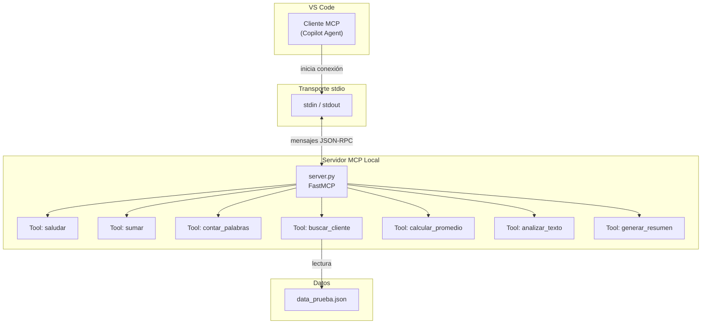
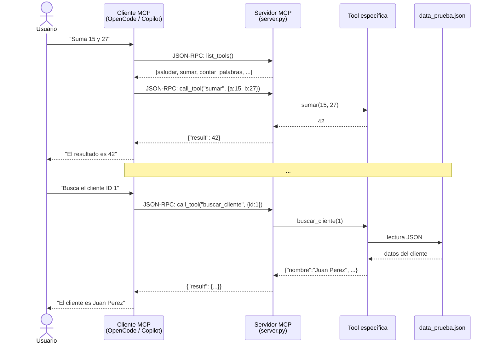
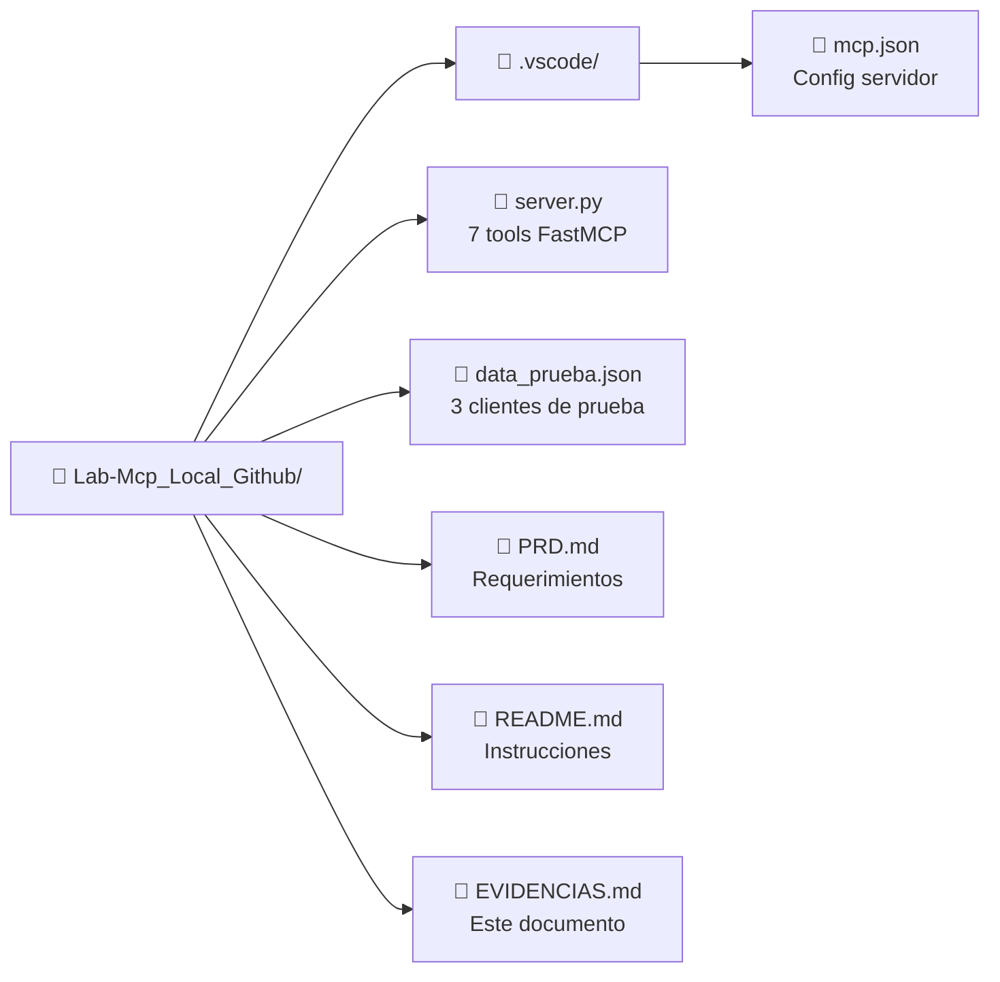

# Evidencias — Laboratorio MCP Local

> **Proyecto**: Lab-Mcp_Local_Github
> **Fecha de pruebas**: 24 de junio de 2026
> **Cliente MCP**: OpenCode (conexión directa vía MCP)
> **Servidor**: `server.py` — FastMCP sobre stdio

---

## Índice

1. [Diagramas de arquitectura](#1-diagramas-de-arquitectura)
2. [Convenciones](#2-convenciones)
3. [A. Tools Base (3 tools)](#a-tools-base-3-tools)
4. [B. Tools de Reto (4 tools)](#b-tools-de-reto-4-tools)
5. [C. Resumen de resultados](#c-resumen-de-resultados)
6. [D. Plan de Pruebas del PRD](#d-plan-de-pruebas-del-prd-sección-7)

---

## 1. Diagramas de arquitectura

### 1.1 Arquitectura general del sistema



**Descripción**: VS Code (o cualquier cliente MCP) inicia el servidor `server.py` a través del transporte stdio. El servidor FastMCP registra 7 tools. Cuando el cliente invoca una tool, el servidor la ejecuta y devuelve el resultado. Las tools que requieren datos (`buscar_cliente`) leen del archivo `data_prueba.json`.

---

### 1.2 Flujo de invocación de una tool



**Descripción**: El cliente MCP descubre las tools disponibles mediante `list_tools()`. Luego invoca una tool específica con `call_tool()`, pasando los argumentos. El servidor ejecuta la función correspondiente y devuelve el resultado estructurado. El cliente presenta la respuesta al usuario en lenguaje natural.

---

### 1.3 Estructura del proyecto



---

## 2. Convenciones

Cada evidencia documenta:
- **Tool**: nombre de la tool invocada
- **Prompt/Input**: argumentos enviados
- **Resultado**: respuesta del servidor
- **Estado**: ✅ Pass / ❌ Fail
- **📸 Captura**: espacio reservado para screenshot de la ejecución

---

## A. Tools Base (3 tools)

### A.1 `saludar`

**Tool**: `saludar(nombre: str) -> str`

| # | Input | Resultado | Estado |
|---|-------|-----------|--------|
| 1 | `{"nombre": "Estudiante"}` | `"¡Hola, Estudiante!"` | ✅ |

```
Prompt:  saludar("Estudiante")
Output:  ¡Hola, Estudiante!
```

> 📸 **Captura A.1** — (*Insertar aquí screenshot de la invocación de `saludar` desde el cliente MCP, mostrando el prompt y el resultado*)
>
> ```
> [   ] Espacio reservado para imagen:
>      - Tool visible en la lista de herramientas
>      - Prompt ingresado
>      - Respuesta obtenida
> ```

---

### A.2 `sumar`

**Tool**: `sumar(a: int, b: int) -> int`

| # | Input | Resultado | Estado |
|---|-------|-----------|--------|
| 1 | `{"a": 15, "b": 27}` | `42` | ✅ |
| 2 | `{"a": 42, "b": 58}` | `100` | ✅ |

```
Prompt:  sumar(15, 27)
Output:  42

Prompt:  sumar(42, 58)
Output:  100
```

> 📸 **Captura A.2** — (*Insertar aquí screenshot de `sumar(15, 27)`, mostrando el resultado 42*)
>
> ```
> [   ] Espacio reservado para imagen:
>      - Invocación de sumar(15, 27)
>      - Resultado: 42
> ```

---

### A.3 `contar_palabras`

**Tool**: `contar_palabras(texto: str) -> int`

| # | Input | Resultado | Estado |
|---|-------|-----------|--------|
| 1 | `{"texto": "Hola mundo, este es un laboratorio de MCP."}` | `8` | ✅ |

```
Prompt:  contar_palabras("Hola mundo, este es un laboratorio de MCP.")
Output:  8
```

> 📸 **Captura A.3** — (*Insertar aquí screenshot de `contar_palabras` mostrando el texto de entrada y el resultado 8*)
>
> ```
> [   ] Espacio reservado para imagen:
>      - Invocación de contar_palabras
>      - Resultado: 8
> ```

---

## B. Tools de Reto (4 tools)

### B.1 `buscar_cliente`

**Tool**: `buscar_cliente(id: int) -> dict`

Lee `data_prueba.json` y busca un cliente por ID.

| # | Input | Resultado | Estado |
|---|-------|-----------|--------|
| 1 | `{"id": 1}` | `{"nombre": "Juan Perez", "email": "juan@example.com"}` | ✅ |
| 2 | `{"id": 2}` | `{"nombre": "Maria Garcia", "email": "maria@example.com"}` | ✅ |
| 3 | `{"id": 3}` | `{"nombre": "Carlos Lopez", "email": "carlos@example.com"}` | ✅ |
| 4 | `{"id": 99}` | `{"error": "Cliente con id 99 no encontrado"}` | ✅ (edge case) |

```
Prompt:  buscar_cliente(1)
Output:  {"nombre": "Juan Perez", "email": "juan@example.com"}

Prompt:  buscar_cliente(99)
Output:  {"error": "Cliente con id 99 no encontrado"}
```

> 📸 **Captura B.1a** — (*Insertar aquí screenshot de `buscar_cliente(1)` mostrando los datos de Juan Perez*)
>
> ```
> [   ] Espacio reservado para imagen:
>      - Invocación: buscar_cliente(1)
>      - Resultado: nombre y email del cliente
> ```
>
> 📸 **Captura B.1b** — (*Insertar aquí screenshot del edge case `buscar_cliente(99)` mostrando el mensaje de error*)
>
> ```
> [   ] Espacio reservado para imagen:
>      - Invocación: buscar_cliente(99)
>      - Resultado: mensaje de error "no encontrado"
> ```

---

### B.2 `calcular_promedio`

**Tool**: `calcular_promedio(calificaciones: list[float]) -> float`

| # | Input | Resultado | Estado |
|---|-------|-----------|--------|
| 1 | `{"calificaciones": [85, 90, 78, 92, 88]}` | `86.6` | ✅ |
| 2 | `{"calificaciones": []}` | `0.0` | ✅ (edge case) |

```
Prompt:  calcular_promedio([85, 90, 78, 92, 88])
Output:  86.6
```

> 📸 **Captura B.2** — (*Insertar aquí screenshot de `calcular_promedio` con las 5 calificaciones y resultado 86.6*)
>
> ```
> [   ] Espacio reservado para imagen:
>      - Invocación: calcular_promedio([85, 90, 78, 92, 88])
>      - Resultado: 86.6
> ```

---

### B.3 `analizar_texto`

**Tool**: `analizar_texto(texto: str) -> dict`

Retorna cantidad de caracteres, palabras y vocales.

| # | Input | Resultado | Estado |
|---|-------|-----------|--------|
| 1 | `{"texto": "Hola mundo, este es un laboratorio de MCP."}` | `{"caracteres": 42, "palabras": 8, "vocales": 15}` | ✅ |
| 2 | `{"texto": "Hola mundo, este es un texto de prueba para el laboratorio MCP local."}` | `{"caracteres": 69, "palabras": 13, "vocales": 25}` | ✅ |

```
Prompt:  analizar_texto("Hola mundo, este es un laboratorio de MCP.")
Output:  {"caracteres": 42, "palabras": 8, "vocales": 15}
```

> 📸 **Captura B.3** — (*Insertar aquí screenshot de `analizar_texto` mostrando el análisis completo*)
>
> ```
> [   ] Espacio reservado para imagen:
>      - Invocación: analizar_texto(...)
>      - Resultado: caracteres, palabras, vocales
> ```

---

### B.4 `generar_resumen`

**Tool**: `generar_resumen(texto: str, n_oraciones: int = 2) -> str`

| # | Input | Resultado | Estado |
|---|-------|-----------|--------|
| 1 | `{"texto": "El laboratorio de MCP consiste en crear un servidor local con FastMCP. Los estudiantes deben implementar 7 tools en total, divididas en 3 base y 4 de retos prácticos. El servidor se comunica por stdio con el cliente MCP.", "n_oraciones": 2}` | `"El laboratorio de MCP consiste en crear un servidor local con FastMCP. Los estudiantes deben implementar 7 tools en total, divididas en 3 base y 4 de retos prácticos."` | ✅ |

```
Prompt:  generar_resumen("El laboratorio de MCP consiste en crear
           un servidor local con FastMCP. Los estudiantes deben
           implementar 7 tools en total, divididas en 3 base y
           4 de retos prácticos. El servidor se comunica por
           stdio con el cliente MCP.", 2)
Output:  "El laboratorio de MCP consiste en crear un servidor
          local con FastMCP. Los estudiantes deben implementar
          7 tools en total, divididas en 3 base y 4 de retos
          prácticos."
```

> 📸 **Captura B.4** — (*Insertar aquí screenshot de `generar_resumen` mostrando el texto original y el resumen generado*)
>
> ```
> [   ] Espacio reservado para imagen:
>      - Invocación: generar_resumen(texto, 2)
>      - Resultado: primeras 2 oraciones
> ```

---

## C. Resumen de resultados

| # | Tool | Tipo | Pruebas | Pass | Fail |
|---|------|------|---------|------|------|
| 1 | `saludar` | Base | 1 | 1 | 0 |
| 2 | `sumar` | Base | 2 | 2 | 0 |
| 3 | `contar_palabras` | Base | 1 | 1 | 0 |
| 4 | `buscar_cliente` | Reto | 4 | 4 | 0 |
| 5 | `calcular_promedio` | Reto | 2 | 2 | 0 |
| 6 | `analizar_texto` | Reto | 2 | 2 | 0 |
| 7 | `generar_resumen` | Reto | 1 | 1 | 0 |
| | **Total** | | **13** | **13** | **0** |

**Resultado general**: ✅ 13/13 pruebas pasaron exitosamente.

---

## D. Plan de Pruebas del PRD (Sección 7)

### Prueba A — `sumar(15, 27)`

| Campo | Resultado |
|-------|-----------|
| Prompt | `sumar(15, 27)` |
| Esperado | `42` |
| Obtenido | `42` |
| Estado | ✅ Pass |

> 📸 **Captura Prueba A** — (*Insertar aquí screenshot de la Prueba A ejecutada desde el cliente MCP*)

### Prueba B — `contar_palabras`

| Campo | Resultado |
|-------|-----------|
| Prompt | `contar_palabras("Hola mundo, este es un laboratorio de MCP.")` |
| Esperado | `8` |
| Obtenido | `8` |
| Estado | ✅ Pass |

> 📸 **Captura Prueba B** — (*Insertar aquí screenshot de la Prueba B ejecutada desde el cliente MCP*)

### Prueba C — `buscar_cliente(ID 1)`

| Campo | Resultado |
|-------|-----------|
| Prompt | `buscar_cliente(1)` |
| Esperado | Nombre y email del cliente ID 1 |
| Obtenido | `{"nombre": "Juan Perez", "email": "juan@example.com"}` |
| Estado | ✅ Pass |

> 📸 **Captura Prueba C** — (*Insertar aquí screenshot de la Prueba C ejecutada desde el cliente MCP*)

---

## E. Checklist de finalización del laboratorio

| # | Ítem | Estado | Evidencia |
|---|------|--------|-----------|
| 1 | `server.py` con 7 tools | ✅ | Código en repo |
| 2 | `.vscode/mcp.json` configurado | ✅ | Archivo en `.vscode/` |
| 3 | `data_prueba.json` con datos | ✅ | Archivo en repo |
| 4 | `README.md` con instrucciones | ✅ | Archivo en repo |
| 5 | Tools base funcionando (3/3) | ✅ | Secciones A.1–A.3 |
| 6 | Tools reto funcionando (4/4) | ✅ | Secciones B.1–B.4 |
| 7 | Prueba A: sumar(15,27)=42 | ✅ | Sección D |
| 8 | Prueba B: contar_palabras=8 | ✅ | Sección D |
| 9 | Prueba C: buscar_cliente(1) | ✅ | Sección D |
| 10 | Capturas de pantalla insertadas | ⬜ | Tú las agregas |
| 11 | Servidor listado en MCP: List Servers | ⬜ | Verificar en VS Code |

---

*Documento generado como evidencia del laboratorio "MCP Local GitHub" — Desarrollo de Software IX.*
