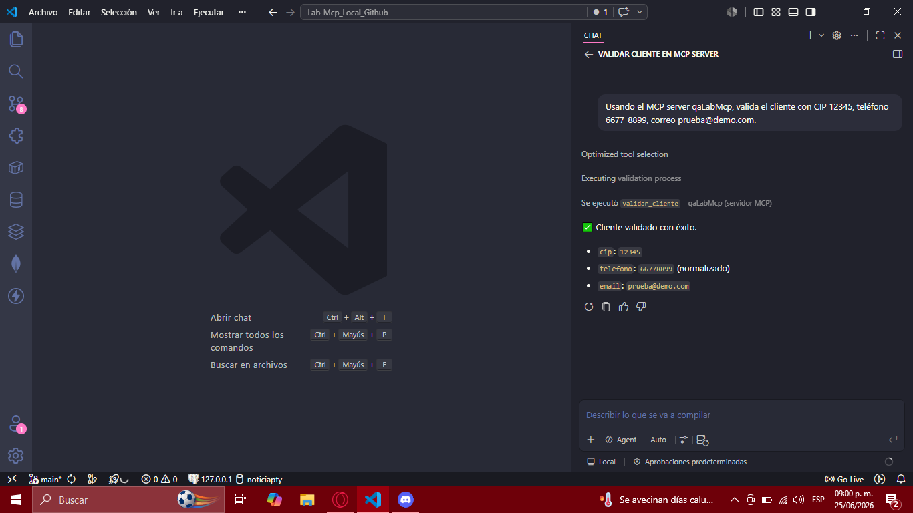
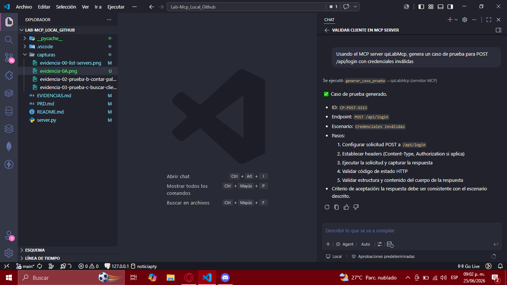
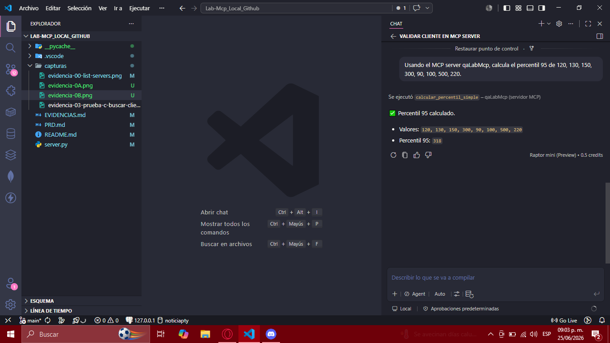
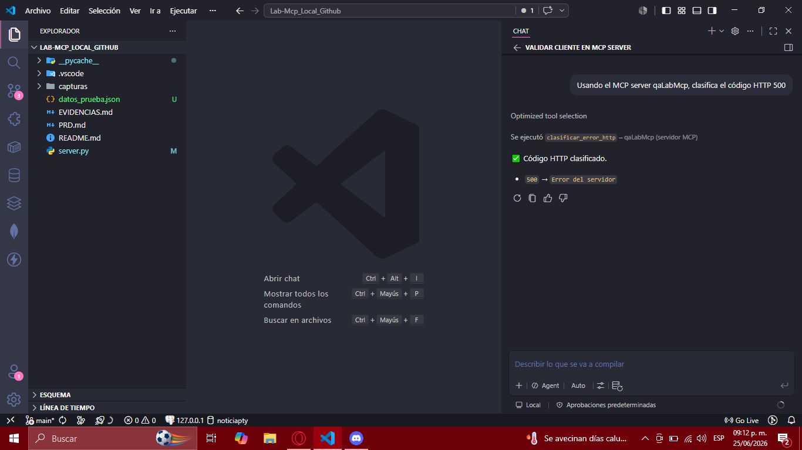
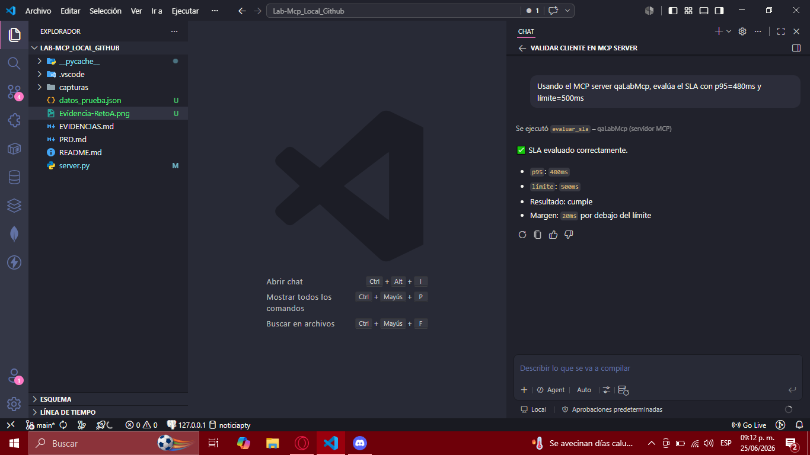
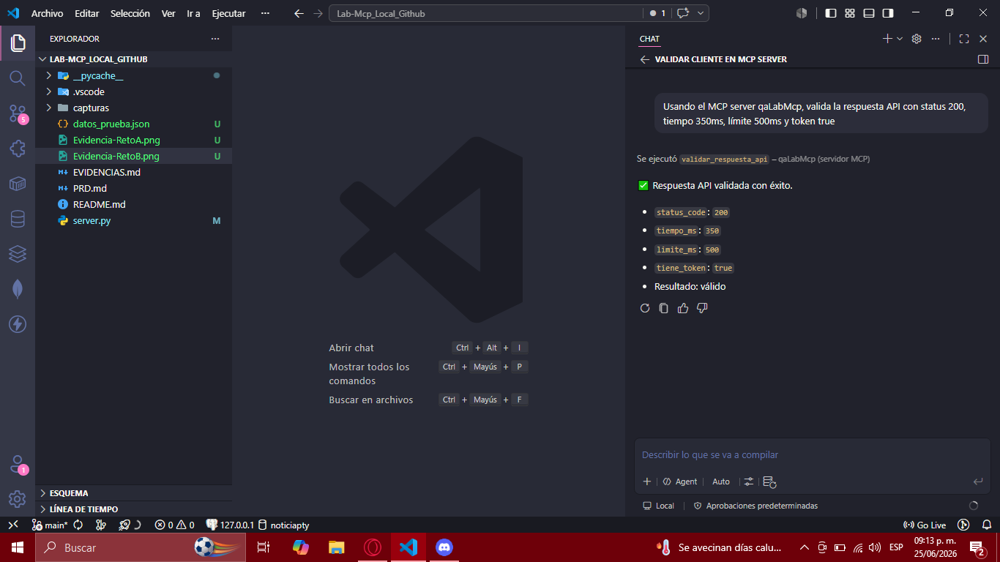
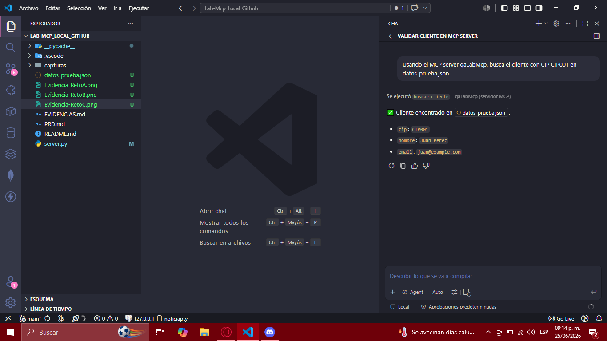

# Evidencias — Laboratorio MCP Local

> **Proyecto**: Lab-Mcp_Local_Github
> **Servidor**: `server.py` — FastMCP("qaLabMcp") sobre stdio
> **Cliente MCP**: GitHub Copilot (modo Agent) en VS Code
> **Tools**: 3 tools base + 4 retos — `validar_cliente`, `generar_caso_prueba`, `calcular_percentil_simple`, `clasificar_error_http`, `evaluar_sla`, `validar_respuesta_api`, `buscar_cliente`

---

## Índice

1. [Tools disponibles](#1-tools-disponibles)
2. [Configuración VS Code](#2-configuración-vs-code)
3. [Prueba A — `validar_cliente`](#3-prueba-a--validar_cliente)
4. [Prueba B — `generar_caso_prueba`](#4-prueba-b--generar_caso_prueba)
5. [Prueba C — `calcular_percentil_simple`](#5-prueba-c--calcular_percentil_simple)
6. [Retos](#6-retos)
   - [RetoA — `clasificar_error_http`](#6a-retoa--clasificar_error_http)
   - [RetoB — `evaluar_sla`](#6b-retob--evaluar_sla)
   - [RetoC — `validar_respuesta_api`](#6c-retoc--validar_respuesta_api)
   - [RetoD — `buscar_cliente`](#6d-retod--buscar_cliente)
7. [Resultados](#7-resultados)

---

## 1. Tools disponibles

| #  | Tool                      | Tipo  | Descripción                                               |
|----|---------------------------|-------|-----------------------------------------------------------|
| 1  | `validar_cliente`         | Base  | Valida y normaliza CIP, teléfono y email.                 |
| 2  | `generar_caso_prueba`     | Base  | Genera un caso de prueba funcional.                       |
| 3  | `calcular_percentil_simple` | Base | Calcula un percentil simple.                            |
| 4  | `clasificar_error_http`   | Reto  | Clasifica código HTTP en categoría.                       |
| 5  | `evaluar_sla`             | Reto  | Evalúa cumplimiento de SLA.                               |
| 6  | `validar_respuesta_api`   | Reto  | Valida respuesta API contra criterios.                    |
| 7  | `buscar_cliente`          | Reto  | Busca cliente por CIP en `datos_prueba.json`.             |

---

## 2. Configuración VS Code

### `.vscode/mcp.json`

```json
{
  "servers": {
    "qaLabMcp": {
      "type": "stdio",
      "command": "python",
      "args": ["server.py"],
      "cwd": "C:\\Users\\ramse\\Documents\\Universidad\\Des_Software IX\\Lab-Mcp_Local_Github"
    }
  }
}
```

### Verificar servidor activo

1. Abrir VS Code en la raíz del proyecto.
2. `Ctrl+Shift+P` → `MCP: List Servers`.
3. Seleccionar `qaLabMcp` → `Start Server`.

**Captura — Servidor listado en VS Code**:


> 📸 **Tomar captura**: Pantallazo de `Ctrl+Shift+P` → `MCP: List Servers` mostrando `qaLabMcp` como servidor disponible.

---

## 3. Prueba A — `validar_cliente`

**Tool**: `validar_cliente(cip: str, telefono: str, email: str) -> dict`

**Prompt para Copilot (modo Agent)**:

> Usando el MCP server qaLabMcp, valida el cliente con CIP 12345, teléfono 6677-8899, correo prueba@demo.com.

**Resultado esperado**:
```json
{
  "valido": true,
  "cip": "12345",
  "telefono": "66778899",
  "email": "prueba@demo.com"
}
```

**Captura — Prueba A desde Copilot Agent**:



> 📸 **Tomar captura**: Pantallazo de Copilot Chat en modo Agent con el prompt y la respuesta devuelta.

### Casos adicionales

| #  | CIP     | Teléfono     | Email               | Resultado esperado                                       | Estado |
|----|---------|-------------|---------------------|----------------------------------------------------------|--------|
| 1  | `12345` | `6677-8899` | `prueba@demo.com`   | `{"valido": true, "cip": "12345", "telefono": "66778899", "email": "prueba@demo.com"}` | ⏳ |
| 2  | `""`    | `1234`      | `invalido`          | `{"valido": false, "errores": {"cip": "...", "telefono": "...", "email": "..."}}` | ⏳ |
| 3  | `ABC01` | `5555-1234` | `USER@Example.COM`  | `{"valido": true, "cip": "ABC01", "telefono": "55551234", "email": "user@example.com"}` | ⏳ |

---

## 4. Prueba B — `generar_caso_prueba`

**Tool**: `generar_caso_prueba(endpoint: str, metodo: str, escenario: str) -> dict`

**Prompt para Copilot (modo Agent)**:

> Usando el MCP server qaLabMcp, genera un caso de prueba para POST /api/login con credenciales inválidas.

**Resultado esperado** (estructura):
```json
{
  "id": "CP-POST-XXXX",
  "endpoint": "/api/login",
  "metodo": "POST",
  "escenario": "Credenciales inválidas",
  "pasos": [
    "Configurar solicitud POST a /api/login",
    "Establecer headers (Content-Type, Authorization si aplica)",
    "Ejecutar la solicitud y capturar la respuesta",
    "Validar código de estado HTTP",
    "Validar estructura y contenido del cuerpo de la respuesta"
  ],
  "criterio_aceptacion": "La respuesta debe ser consistente con el escenario descrito"
}
```

**Captura — Prueba B desde Copilot Agent**:



> 📸 **Tomar captura**: Pantallazo de Copilot Chat en modo Agent con el prompt y la respuesta devuelta.

### Casos adicionales

| #  | Endpoint       | Método | Escenario                          | Resultado esperado | Estado |
|----|---------------|--------|------------------------------------|--------------------|--------|
| 1  | `/api/login`  | POST   | Credenciales inválidas             | Caso estructurado  | ⏳ |
| 2  | `/api/users`  | GET    | Listar usuarios sin autenticación  | Caso estructurado  | ⏳ |

---

## 5. Prueba C — `calcular_percentil_simple`

**Tool**: `calcular_percentil_simple(valores: list[float], percentil: float) -> float`

**Prompt para Copilot (modo Agent)**:

> Usando el MCP server qaLabMcp, calcula el percentil 95 de [120, 130, 150, 300, 90, 100, 500, 220].

**Resultado esperado**: `318.0`

**Cálculo manual**:
- Valores originales: `[120, 130, 150, 300, 90, 100, 500, 220]`
- `r = 0.95 * (8 - 1) = 6.65`
- `k = 6`, `delta = 0.65`
- `valores[6] = 500`, `valores[7] = 220`
- `P95 = 500 + 0.65 * (220 - 500) = 500 - 182 = 318.0`

**Captura — Prueba C desde Copilot Agent**:



> 📸 **Tomar captura**: Pantallazo de Copilot Chat en modo Agent con el prompt y la respuesta devuelta.

### Casos adicionales

| #  | Valores                                              | Percentil | Resultado esperado | Estado |
|----|------------------------------------------------------|-----------|-------------------|--------|
| 1  | `[120, 130, 150, 300, 90, 100, 500, 220]`           | 95        | `318.0`           | ⏳ |
| 2  | `[10, 20, 30, 40, 50]`                               | 50        | `30.0`            | ⏳ |
| 3  | `[100]`                                              | 50        | `100.0`           | ⏳ |

---

## 6. Retos

### 6a. RetoA — `clasificar_error_http`

**Tool**: `clasificar_error_http(status_code: int) -> str`

**Prompt**:
> Usando el MCP server qaLabMcp, clasifica el código HTTP 500.

**Resultado esperado**: `"Error del servidor"`

**Captura**:



### 6b. RetoB — `evaluar_sla`

**Tool**: `evaluar_sla(p95_ms: float, limite_ms: float) -> dict`

**Prompt**:
> Usando el MCP server qaLabMcp, evalúa el SLA con p95=480ms y límite=500ms.

**Resultado esperado**: `{"cumple": true, "diferencia_ms": 20}`

**Captura**:



### 6c. RetoC — `validar_respuesta_api`

**Tool**: `validar_respuesta_api(status_code: int, tiempo_ms: float, limite_ms: float, tiene_token: bool) -> dict`

**Prompt**:
> Usando el MCP server qaLabMcp, valida la respuesta API con status 200, tiempo 350ms, límite 500ms y token true.

**Resultado esperado**: `{"valido": true, "razon": "La respuesta cumple con todos los criterios"}`

**Captura**:



### 6d. RetoD — `buscar_cliente`

**Tool**: `buscar_cliente(cip: str) -> dict`

**Prompt**:
> Usando el MCP server qaLabMcp, busca el cliente con CIP CIP001 en datos_prueba.json.

**Resultado esperado**: `{"cip": "CIP001", "nombre": "Juan Perez", "email": "juan@example.com"}`

**Captura**:



---

## 7. Resultados

| #  | Tool                      | Tipo  | Pruebas | Pass | Fail | Captura                 |
|----|---------------------------|-------|---------|------|------|--------------------------|
| 1  | `validar_cliente`         | Base  | 3       | 0    | 0    | `evidencia-0A.png`       |
| 2  | `generar_caso_prueba`     | Base  | 2       | 0    | 0    | `evidencia-0B.png`       |
| 3  | `calcular_percentil_simple` | Base | 3     | 0    | 0    | `evidencia-0C.png`       |
| 4  | `clasificar_error_http`   | Reto  | 1       | 0    | 0    | `Evidencia-RetoA.png`    |
| 5  | `evaluar_sla`             | Reto  | 1       | 0    | 0    | `Evidencia-RetoB.png`    |
| 6  | `validar_respuesta_api`   | Reto  | 1       | 0    | 0    | `Evidencia-RetoC.png`    |
| 7  | `buscar_cliente`          | Reto  | 2       | 0    | 0    | `Evidencia-RetoD.png`    |
|    | **Total**                 |       | **13**  | **0**| **0**| —                        |

### Lista de capturas

| #  | Archivo                          | Contenido                                                     |
|----|----------------------------------|---------------------------------------------------------------|
| 00 | `evidencia-00-list-servers.png`  | MCP: List Servers mostrando `qaLabMcp` disponible             |
| 01 | `evidencia-0A.png`               | Copilot Agent + `validar_cliente`                             |
| 02 | `evidencia-0B.png`               | Copilot Agent + `generar_caso_prueba`                         |
| 03 | `evidencia-0C.png`               | Copilot Agent + `calcular_percentil_simple`                   |
| 04 | `Evidencia-RetoA.png`            | Copilot Agent + `clasificar_error_http(500)`                  |
| 05 | `Evidencia-RetoB.png`            | Copilot Agent + `evaluar_sla(480, 500)`                       |
| 06 | `Evidencia-RetoC.png`            | Copilot Agent + `validar_respuesta_api(200, 350, 500, true)`  |
| 07 | `Evidencia-RetoD.png`            | Copilot Agent + `buscar_cliente("CIP001")`                    |

---

*Documento generado como evidencia del laboratorio "MCP Local — qaLabMcp" — Desarrollo de Software IX.*
