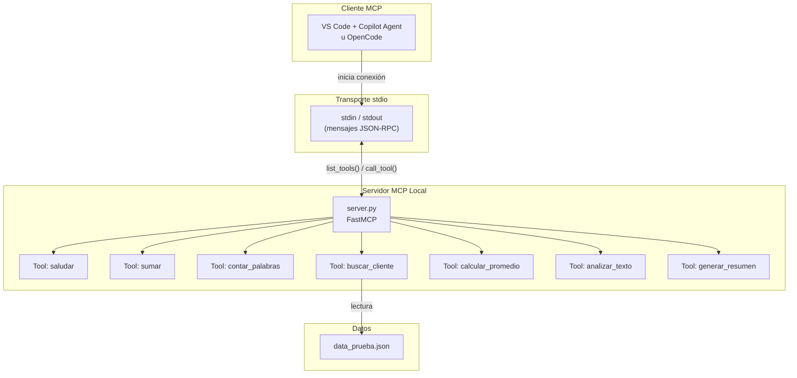
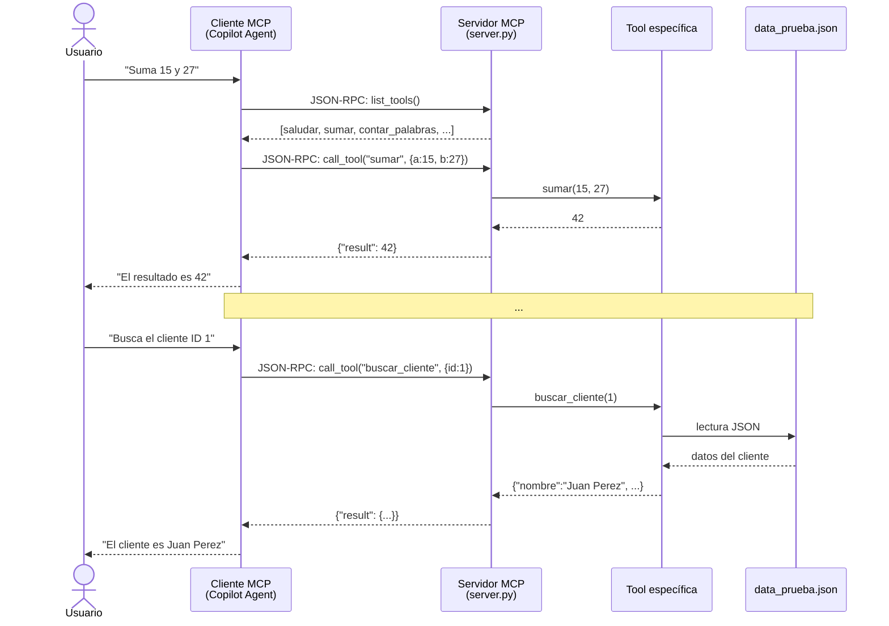

# Laboratorio MCP Local GitHub — Desarrollo de Software IX

Servidor MCP (*Model Context Protocol*) local construido con Python y FastMCP. Expone 7 herramientas (tools) que pueden ser descubiertas y ejecutadas desde cualquier cliente MCP compatible (GitHub Copilot en modo Agent, OpenCode, etc.).

---

## Índice

1. [¿Cómo funciona MCP?](#1-cómo-funciona-mcp)
2. [Requisitos](#2-requisitos)
3. [Instalación](#3-instalación)
4. [Estructura del proyecto](#4-estructura-del-proyecto)
5. [Tools disponibles](#5-tools-disponibles)
6. [Configuración en VS Code](#6-configuración-en-vs-code)
7. [Ejecución directa (sin VS Code)](#7-ejecución-directa-sin-vs-code)
8. [Pruebas](#8-pruebas)

---

## 1. ¿Cómo funciona MCP?

### Arquitectura general



El cliente MCP (VS Code con Copilot) inicia el servidor `server.py` como un proceso hijo comunicándose por **stdin/stdout** mediante mensajes **JSON-RPC**. El servidor registra las 7 tools con FastMCP. Cuando el usuario pide algo, Copilot descubre las tools disponibles (`list_tools`) e invoca la adecuada (`call_tool`).

---

### Flujo de invocación paso a paso



1. El usuario escribe un prompt en lenguaje natural
2. Copilot descubre las tools disponibles mediante `list_tools()`
3. Copilot selecciona la tool adecuada y la invoca con `call_tool()`
4. FastMCP ejecuta la función Python correspondiente
5. El servidor devuelve el resultado estructurado al cliente
6. Copilot presenta la respuesta al usuario en lenguaje natural

---

## 2. Requisitos

| Requerimiento | Especificación |
|---------------|----------------|
| Lenguaje | Python 3.10+ |
| SDK | FastMCP (`pip install fastmcp`) |
| SO | Windows 10/11 |
| Editor | VS Code (opcional, con extensión GitHub Copilot) |
| Gestor de paquetes | `pip` |

---

## 3. Instalación

```bash
# Clonar el repositorio
git clone https://github.com/RamsesSzobotka/Lab-Mcp_Local_Github.git
cd Lab-Mcp_Local_Github

# (Opcional) Crear y activar entorno virtual
python -m venv venv
.\venv\Scripts\activate

# Instalar dependencias
pip install fastmcp
```

---

## 4. Estructura del proyecto

```
Lab-Mcp_Local_Github/
├── .vscode/
│   └── mcp.json                    # Configuración del servidor MCP para VS Code
├── .atl/
│   └── skill-registry.md           # Registro de skills del agente
├── server.py                       # Servidor MCP con FastMCP (7 tools)
├── data_prueba.json                # Archivo de datos para retos prácticos
├── PRD.md                          # Documento de requerimientos del laboratorio
├── README.md                       # Este archivo
├── GUIA_PRUEBAS_COPILOT.md         # Guía paso a paso para pruebas desde Copilot
├── EVIDENCIAS.md                   # Resultados de pruebas y evidencias
└── capturas/
    ├── evidencia-00-list-servers.png
    ├── evidencia-01-prueba-a-sumar.png
    ├── evidencia-02-prueba-b-contar-palabras.png
    └── evidencia-03-prueba-c-buscar-cliente.png
```

---

## 5. Tools disponibles

### Tools Base

| Tool | Descripción | Ejemplo |
|------|-------------|---------|
| `saludar` | Saluda a una persona por su nombre | `saludar("Juan")` → `¡Hola, Juan!` |
| `sumar` | Suma dos números enteros | `sumar(15, 27)` → `42` |
| `contar_palabras` | Cuenta palabras en un texto | `contar_palabras("Hola mundo")` → `2` |

### Tools de Reto

| Tool | Descripción | Ejemplo |
|------|-------------|---------|
| `buscar_cliente` | Busca cliente por ID en `data_prueba.json` | `buscar_cliente(1)` → datos de Juan Perez |
| `calcular_promedio` | Calcula promedio de calificaciones | `calcular_promedio([85,90,78])` → `84.33` |
| `analizar_texto` | Analiza caracteres, palabras y vocales | `analizar_texto("Hola")` → stats del texto |
| `generar_resumen` | Genera resumen de primeras N oraciones | `generar_resumen(texto, 2)` → primeras 2 oraciones |

---

## 6. Configuración en VS Code

El servidor se registra automáticamente en VS Code mediante el archivo `.vscode/mcp.json`:

```json
{
  "servers": {
    "lab-mcp-local": {
      "type": "stdio",
      "command": "python",
      "args": ["server.py"],
      "cwd": "C:\\Users\\ramse\\Documents\\Universidad\\Des_Software IX\\Lab-Mcp_Local_Github"
    }
  }
}
```

### Verificar que el servidor está activo

1. Abrir VS Code en la raíz del proyecto
2. Abrir la paleta de comandos (`Ctrl+Shift+P`)
3. Ejecutar `MCP: List Servers`
4. Debería aparecer `lab-mcp-local` como servidor disponible


---

## 7. Ejecución directa (sin VS Code)

```bash
python server.py
```

El servidor se inicia en modo `stdio` y queda a la espera de conexiones del cliente MCP.

Para probar las tools individualmente desde cualquier cliente MCP compatible, consulta la [guía de pruebas](./GUIA_PRUEBAS_COPILOT.md).

---

## 8. Pruebas

Las pruebas se documentan en [EVIDENCIAS.md](./EVIDENCIAS.md) e incluyen:

| Prueba | Tool | Prompt | Resultado esperado | Estado |
|--------|------|--------|-------------------|--------|
| A | `sumar` | "Suma 15 y 27" | `42` | ✅ |
| B | `contar_palabras` | "Cuenta las palabras: 'Hola mundo...'" | `8` | ✅ |
| C | `buscar_cliente` | "Busca el cliente con ID 1" | Juan Perez | ✅ |

Además, las 7 tools fueron probadas individualmente con **13/13 pruebas exitosas**.

Para instrucciones detalladas de cómo ejecutar las pruebas desde GitHub Copilot en modo Agent, consulta [GUIA_PRUEBAS_COPILOT.md](./GUIA_PRUEBAS_COPILOT.md).

---

*Laboratorio "MCP Local GitHub" — Desarrollo de Software IX.*
